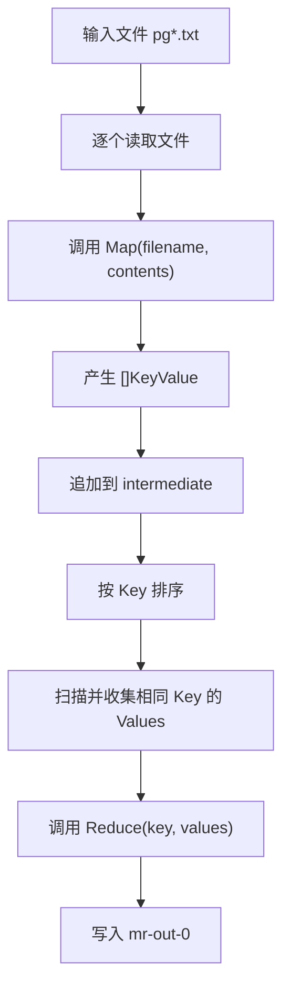

> 本文是 MIT 6.5840 Lab 1 MapReduce 学习笔记的第一篇。本文暂时不讨论 Coordinator、Worker、RPC 和故障恢复，而是先通过官方顺序版程序建立一条完整的数据处理链路：**Input → Map → KeyValue → Sort/Group → Reduce → Output**。

## 1. Lab 1 要实现什么

MIT 6.5840 Lab 1 要实现一个简化版的分布式 MapReduce 系统。

最终系统中会存在两类核心角色：

- **Coordinator**：管理任务、分配任务、记录任务状态，并重新调度超时任务。
- **Worker**：向 Coordinator 请求任务，执行 Map 或 Reduce，并报告任务完成。

但是在开始编写分布式版本前，必须先理解官方提供的顺序版程序。因为顺序版和分布式版虽然执行方式不同，核心数据处理逻辑却完全一致：

```text
读取输入文件
    ↓
调用 Map 产生中间 KeyValue
    ↓
让相同 Key 的数据聚集到一起
    ↓
调用 Reduce 汇总结果
    ↓
写入输出文件
```

顺序版把所有工作放在一个进程里依次执行；Lab 1 则要把同样的工作拆给多个 Worker 并发执行，并处理 RPC、任务状态、超时和故障恢复。

因此，`mrsequential.go` 可以看成整个 Lab 1 的“单机原型”。

---

## 2. MapReduce 要解决什么问题

假设我们需要统计数百 GB 文本中每个单词出现的次数。最直接的单机写法是：

1. 依次读取全部文件；
2. 使用哈希表记录每个单词的次数；
3. 遍历结束后输出结果。

数据量较小时，这种做法完全可行。但当数据大到一台机器无法高效处理时，就会遇到几个问题：

- 如何把输入数据拆给多台机器？
- 多台机器如何独立计算，尽量避免共享状态？
- 不同机器产生的相同单词如何汇总？
- 某台机器执行到一半宕机了怎么办？
- 如何让业务代码不必关心底层的任务调度和容错？

MapReduce 的核心思想，是把一个大型数据处理任务抽象为两个相对简单的函数：

```text
Map：把输入转换成一批中间 KeyValue
Reduce：汇总同一个 Key 对应的全部 Value
```

框架负责数据拆分、任务调度、中间数据组织和故障恢复；使用者只需要提供具体的 `Map()` 与 `Reduce()` 业务逻辑。

以 WordCount 为例：

```text
输入："hello world hello"

Map 输出：
(hello, 1)
(world, 1)
(hello, 1)

Reduce 输入：
hello → [1, 1]
world → [1]

最终输出：
hello 2
world 1
```

这里非常重要的一点是：**Map 不负责直接计算全局最终答案。**

不同 Map 任务只负责产生中间结果，因此可以彼此独立地运行。这样既避免了多个 Worker 同时修改一个共享哈希表，也让任务更容易并行和重试。

---

## 3. MapReduce 的整体执行流程

一轮完整的 MapReduce 可以分成五个逻辑阶段。

### 3.1 Input：切分输入数据

输入通常由多个文件或多个数据分片组成。不同的 Map Task 可以处理不同的输入分片。

例如：

```text
Map Task 0 → a.txt
Map Task 1 → b.txt
Map Task 2 → c.txt
```

### 3.2 Map：生成中间 KeyValue

每个 Map Task 读取自己的输入，并调用用户提供的 `Map()`：

```text
a.txt: "hello world"
    ↓ Map
(hello, 1), (world, 1)
```

### 3.3 Shuffle：重新组织中间数据

Map 输出的顺序通常是杂乱的，但 Reduce 需要一次拿到某个 Key 的全部 Value。因此框架必须重新组织中间数据，让相同 Key 最终流向同一个 Reduce Task。

### 3.4 Sort/Group：按 Key 排序并分组

经过排序后，相同 Key 会连续出现：

```text
排序前：world, hello, MIT, hello
排序后：MIT, hello, hello, world
```

随后就能把连续的相同 Key 组织成：

```text
hello → [1, 1]
```

### 3.5 Reduce：汇总并输出结果

Reduce 对同一个 Key 的全部 Value 进行计算：

```text
Reduce("hello", ["1", "1"]) → "2"
```

最终得到：

```text
hello 2
```

需要注意，官方顺序版没有真正独立的 Shuffle 阶段，而是把所有 Map 输出放进一个切片，再通过排序和扫描完成分组。真正的分布式版本会使用多个中间文件完成 Map 到 Reduce 的数据交换。

---

## 4. Map 与 Reduce 的职责

MIT 6.5840 的 Map 和 Reduce 函数类型分别为：

```go
func Map(filename string, contents string) []mr.KeyValue

func Reduce(key string, values []string) string
```

### Map 的职责

Map 接收：

- 当前输入文件的名称；
- 当前输入文件的完整内容。

Map 返回：

- 一组中间 `KeyValue`。

WordCount 中，Map 的工作是把文本拆成单词，然后为每次出现的单词生成一条 `(word, "1")`。

### Reduce 的职责

Reduce 接收：

- 一个 Key；
- 该 Key 对应的全部 Value。

Reduce 返回：

- 这个 Key 的最终统计结果，以字符串表示。

WordCount 中，Reduce 不需要解析每个 Value 的具体内容，因为每次出现都对应一个 `"1"`，所以 `values` 的长度就是单词出现次数。

Map 与 Reduce 之间的契约可以概括为：

```text
Map 产生：  (K, V)
框架组织： K → [V1, V2, V3, ...]
Reduce 计算：Reduce(K, [V...]) → Result
```

---

## 5. KeyValue：贯穿系统的中间数据

Lab 1 中的中间数据结构非常简单：

```go
type KeyValue struct {
    Key   string
    Value string
}
```

以 WordCount 为例：

```go
mr.KeyValue{Key: "hello", Value: "1"}
```

它表示单词 `hello` 出现了一次。

为什么 Key 和 Value 都设计成字符串？

因为 MapReduce 框架不应该绑定某一种具体业务。WordCount 的 Value 可以是 `"1"`，倒排索引的 Value 可以是文件名，其他任务的 Value 也可以是序列化后的数据。统一使用字符串，接口会更加通用，数据写入中间文件也更加方便。

`KeyValue` 是整个系统中连接 Map 和 Reduce 的桥梁：

```text
输入文件
   ↓
Map
   ↓
[]KeyValue
   ↓
排序、分组或分区
   ↓
Reduce
```

---

## 6. WordCount 示例：wc.go

官方提供的 `mrapps/wc.go` 定义了 WordCount 的 Map 和 Reduce 逻辑。其核心代码可以简化为：

```go
package main

import (
    "6.5840/mr"
    "strconv"
    "strings"
    "unicode"
)

func Map(filename string, contents string) []mr.KeyValue {
    ff := func(r rune) bool {
        return !unicode.IsLetter(r)
    }

    words := strings.FieldsFunc(contents, ff)

    kva := []mr.KeyValue{}
    for _, word := range words {
        kva = append(kva, mr.KeyValue{
            Key:   word,
            Value: "1",
        })
    }
    return kva
}

func Reduce(key string, values []string) string {
    return strconv.Itoa(len(values))
}
```

这份代码只描述“如何统计单词”，并不关心以下问题：

- 输入文件由谁分配；
- Map 在哪个进程里执行；
- 中间结果保存在哪里；
- 相同 Key 如何聚合；
- Reduce 在哪个 Worker 上执行；
- Worker 失败后任务如何重试。

这些都是 MapReduce 框架的职责。`wc.go` 只包含业务逻辑，这体现了框架与应用代码的解耦。

为了让框架在运行时使用这两个函数，需要先把 `wc.go` 编译成 Go 插件：

```bash
go build -buildmode=plugin ../mrapps/wc.go
```

编译后得到 `wc.so`。顺序版程序会在运行时动态加载它：

```bash
go run mrsequential.go wc.so pg*.txt
```

---

## 7. Map 函数实现分析

### 7.1 定义单词分隔规则

```go
ff := func(r rune) bool {
    return !unicode.IsLetter(r)
}
```

这是一个匿名函数。它接收一个 Unicode 字符 `r`：

- 如果 `r` 不是字母，则返回 `true`；
- `strings.FieldsFunc` 会把返回 `true` 的字符当作分隔符。

因此空格、逗号、句号、数字和其他非字母字符都会被用来切分文本。

这里使用 `rune` 而不是 `byte`，是因为 `rune` 表示一个 Unicode 码点，能够正确处理不止 ASCII 范围内的字符。

### 7.2 拆分文本

```go
words := strings.FieldsFunc(contents, ff)
```

例如：

```text
contents = "Hello, MIT 6.5840!"
```

经过拆分后，结果大致为：

```text
["Hello", "MIT"]
```

### 7.3 为每个单词生成 KeyValue

```go
kva := []mr.KeyValue{}
for _, word := range words {
    kva = append(kva, mr.KeyValue{
        Key:   word,
        Value: "1",
    })
}
```

假设输入为：

```text
hello world hello
```

Map 返回：

```text
[
    (hello, 1),
    (world, 1),
    (hello, 1),
]
```

这里的 `_` 表示忽略 `range` 返回的下标，只使用元素本身；`append` 用于向切片末尾追加元素。

再次强调：Map 并没有在本地使用哈希表直接得出 `hello = 2`。它只记录每一次出现，将聚合工作交给框架和 Reduce。这使不同 Map Task 之间不需要共享可变状态。

---

## 8. Reduce 函数实现分析

WordCount 的 Reduce 非常短：

```go
func Reduce(key string, values []string) string {
    return strconv.Itoa(len(values))
}
```

假设框架调用：

```go
Reduce("hello", []string{"1", "1", "1"})
```

那么：

```text
len(values) = 3
```

而 Reduce 的返回类型是 `string`，因此通过：

```go
strconv.Itoa(3)
```

把整数 `3` 转换为字符串 `"3"`。

这里的 `key` 没有在函数体中使用，因为 WordCount 只需要计算 Value 的数量。框架在写输出时仍然会将原 Key 与 Reduce 的返回值一起写入结果文件。

如果 Value 并不总是 `"1"`，Reduce 就可能需要遍历并解析每一个 Value。例如：

```go
sum := 0
for _, value := range values {
    number, _ := strconv.Atoi(value)
    sum += number
}
return strconv.Itoa(sum)
```

因此，`len(values)` 是 WordCount 这个具体实现的简化，而不是所有 Reduce 的固定写法。

---

## 9. 顺序版程序 mrsequential.go

`mrsequential.go` 是一个单进程 MapReduce 执行器。它的核心流程可以概括为：

```go
mapf, reducef := loadPlugin(os.Args[1])

intermediate := []mr.KeyValue{}

for _, filename := range os.Args[2:] {
    // 读取文件
    // 调用 mapf
    // 收集全部 KeyValue
}

sort.Sort(ByKey(intermediate))

// 扫描排好序的 intermediate
// 收集相同 Key 的全部 Value
// 调用 reducef
// 写入 mr-out-0
```

### 9.1 通过插件加载 Map 和 Reduce

```go
mapf, reducef := loadPlugin(os.Args[1])
```

`os.Args[1]` 是命令行传入的插件路径，例如 `wc.so`。`loadPlugin()` 的核心实现为：

```go
p, err := plugin.Open(filename)
if err != nil {
    log.Fatalf("cannot load plugin %v", filename)
}

xmapf, err := p.Lookup("Map")
if err != nil {
    log.Fatalf("cannot find Map in %v", filename)
}
mapf := xmapf.(func(string, string) []mr.KeyValue)

xreducef, err := p.Lookup("Reduce")
if err != nil {
    log.Fatalf("cannot find Reduce in %v", filename)
}
reducef := xreducef.(func(string, []string) string)
```

其中：

- `plugin.Open(filename)` 打开动态插件；
- `Lookup("Map")` 根据名称查找导出的 `Map` 符号；
- `Lookup("Reduce")` 查找 `Reduce` 符号；
- 类型断言把查找到的通用符号转换为确定的函数类型。

例如：

```go
xmapf.(func(string, string) []mr.KeyValue)
```

表示：“我期望 `xmapf` 的真实类型就是这个 Map 函数类型。”如果插件内的函数签名不匹配，类型断言会失败。

通过插件机制，同一个 MapReduce 执行框架可以运行不同的应用：

```text
mrsequential.go + wc.so       → 单词计数
mrsequential.go + indexer.so  → 倒排索引
```

执行框架不需要为了不同业务被重复编译和重写。

### 9.2 自定义排序规则

源码定义了：

```go
type ByKey []mr.KeyValue

func (a ByKey) Len() int           { return len(a) }
func (a ByKey) Swap(i, j int)      { a[i], a[j] = a[j], a[i] }
func (a ByKey) Less(i, j int) bool { return a[i].Key < a[j].Key }
```

`ByKey` 的底层类型是 `[]mr.KeyValue`，但它额外实现了排序需要的三个方法：

- `Len()`：返回元素个数；
- `Swap(i, j)`：交换两个元素；
- `Less(i, j)`：判断第 `i` 个元素是否应该排在第 `j` 个元素前面。

`Less()` 比较的是 `Key`，因此：

```go
sort.Sort(ByKey(intermediate))
```

会按照 Key 从小到大排列中间结果。

如果类比 C++，它的作用类似于给 `std::sort` 提供一个按照 `Key` 比较的排序规则。不同之处在于，Go 通过实现接口所需的方法，让类型具备可排序能力。

---

## 10. 输入文件如何被读取

顺序版的运行方式为：

```bash
go run mrsequential.go wc.so pg*.txt
```

Shell 会先把 `pg*.txt` 展开为多个实际文件名。因此程序看到的参数大致是：

```text
os.Args[0] = mrsequential.go
os.Args[1] = wc.so
os.Args[2] = pg-being_ernest.txt
os.Args[3] = pg-dorian_gray.txt
...
```

程序首先检查参数数量：

```go
if len(os.Args) < 3 {
    fmt.Fprintf(os.Stderr, "Usage: mrsequential xxx.so inputfiles...\n")
    os.Exit(1)
}
```

至少需要一个插件和一个输入文件，否则程序打印用法并以非零状态退出。

随后遍历所有输入文件：

```go
for _, filename := range os.Args[2:] {
    file, err := os.Open(filename)
    if err != nil {
        log.Fatalf("cannot open %v", filename)
    }

    content, err := ioutil.ReadAll(file)
    if err != nil {
        log.Fatalf("cannot read %v", filename)
    }

    file.Close()
    // ...
}
```

关键点如下：

- `os.Args[2:]` 表示从下标 2 一直到切片末尾；
- `os.Open()` 返回文件对象和错误；
- 成功时 `err == nil`，失败时 `err != nil`；
- `ioutil.ReadAll(file)` 读取整个文件，得到 `[]byte`；
- 文件使用完毕后调用 `file.Close()`。

官方代码使用 `ioutil.ReadAll`。在较新的 Go 代码中，通常可以使用 `io.ReadAll`，但理解 Lab 提供的原始实现即可。

顺序版一次把一个文件完整读进内存，适合作为教学原型，但它不是处理超大单文件的通用方案。

---

## 11. Map 输出如何被收集

程序先创建一个空切片：

```go
intermediate := []mr.KeyValue{}
```

它负责保存所有文件经过 Map 后产生的中间结果。

每读取一个文件，就调用一次 Map：

```go
kva := mapf(filename, string(content))
```

`content` 原本是 `[]byte`，而 Map 的第二个参数要求 `string`，所以这里使用 `string(content)` 完成类型转换。

`kva` 只包含当前文件产生的结果。随后：

```go
intermediate = append(intermediate, kva...)
```

把它追加到总切片中。

假设两个文件的 Map 输出分别为：

```text
a.txt → [(hello, 1), (world, 1)]
b.txt → [(hello, 1), (MIT, 1)]
```

最终：

```text
intermediate = [
    (hello, 1),
    (world, 1),
    (hello, 1),
    (MIT, 1),
]
```

`kva...` 表示把切片展开，将其中的每个元素依次传给 `append`。它类似于 C++ 中把一个 `vector` 的整个区间插入另一个 `vector` 的末尾。

这里也是顺序版与真正分布式 MapReduce 的一个关键区别：

```text
顺序版：所有 Map 输出都保存在同一个 intermediate 切片中
分布式版：Map 输出按照 Reduce 分区写入多个中间文件
```

分布式系统无法假设全部中间数据都能放进同一个进程的内存，因此 Lab 1 后续会把中间数据写成形如 `mr-X-Y` 的文件。

---

## 12. 为什么需要排序与分组

Map 完成后，中间结果可能是：

```text
(world, 1)
(hello, 1)
(MIT, 1)
(hello, 1)
(apple, 1)
(hello, 1)
```

但 Reduce 需要的输入形式是：

```text
hello → [1, 1, 1]
```

也就是说，在调用 Reduce 之前，框架必须找到同一个 Key 对应的全部 Value。

一种做法是使用哈希表分组，顺序版采用的则是 **Sort + Group**：

```go
sort.Sort(ByKey(intermediate))
```

排序后：

```text
(MIT, 1)
(apple, 1)
(hello, 1)
(hello, 1)
(hello, 1)
(world, 1)
```

相同 Key 自动变得连续。此时只要从左到右扫描一次，就能找到每个 Key 的完整区间。

排序的作用不是完成统计，而是为分组创造条件：

```text
无序数据
   ↓ 按 Key 排序
相同 Key 连续
   ↓ 线性扫描
Key → []Value
```

设中间数据数量为 `N`：

- 排序通常需要 `O(N log N)`；
- 排序后的分组扫描需要 `O(N)`。

---

## 13. Reduce 如何接收同一 Key 的全部 Value

排序完成后，程序使用两个下标寻找一组相同 Key 的区间：

```go
i := 0
for i < len(intermediate) {
    j := i + 1
    for j < len(intermediate) &&
        intermediate[j].Key == intermediate[i].Key {
        j++
    }

    values := []string{}
    for k := i; k < j; k++ {
        values = append(values, intermediate[k].Value)
    }

    output := reducef(intermediate[i].Key, values)
    // 写入结果

    i = j
}
```

假设排好序的数据为：

```text
下标  Key     Value
0     apple   1
1     hello   1
2     hello   1
3     hello   1
4     world   1
```

当 `i = 1` 时：

1. `j` 从 `i + 1`，也就是 2 开始；
2. 只要 `intermediate[j].Key == intermediate[i].Key`，`j` 就继续右移；
3. 当 `j = 4` 时遇到 `world`，循环停止；
4. 此时半开区间 `[i, j)`，也就是 `[1, 4)`，全部属于 `hello`。

接着遍历 `[i, j)`，收集 Value：

```text
values = ["1", "1", "1"]
```

然后调用：

```go
output := reducef("hello", values)
```

得到：

```text
output = "3"
```

最后执行：

```go
i = j
```

因为 `[i, j)` 已经全部处理完毕，下一轮应当直接从下一个不同的 Key 开始。在本例中，`i` 会从 1 直接变成 4，开始处理 `world`。

这段代码本质上是一个双指针分组过程：

- `i` 指向当前分组的起点；
- `j` 指向当前分组之后的第一个位置；
- `[i, j)` 是当前 Key 的完整数据范围。

---

## 14. 最终结果如何写入 mr-out-0

顺序版先创建输出文件：

```go
oname := "mr-out-0"
ofile, _ := os.Create(oname)
```

`os.Create()` 会创建文件；如果文件已经存在，则会截断原内容。它实际返回文件对象和错误，官方代码通过 `_` 忽略了错误。工程代码通常应该显式检查这个错误。

每处理完一个 Key，就把 Key 和 Reduce 的返回值写入文件：

```go
fmt.Fprintf(
    ofile,
    "%v %v\n",
    intermediate[i].Key,
    output,
)
```

例如：

```text
hello 3
```

所有 Key 处理完毕后关闭文件：

```go
ofile.Close()
```

最终的 `mr-out-0` 可能类似：

```text
MIT 1
apple 2
hello 3
world 1
```

为什么叫 `mr-out-0`？

因为顺序版只有一个 Reduce 执行流程，所以只产生一个输出文件。真正的分布式版本会启动多个 Reduce Task。如果 `nReduce = N`，最终就会产生：

```text
mr-out-0
mr-out-1
mr-out-2
...
mr-out-(N-1)
```

这些输出文件共同组成整个 MapReduce Job 的最终结果。

---

## 15. 顺序版 MapReduce 的完整数据流

把前面的内容连起来，顺序版的数据流如下：



如果用伪代码表示：

```text
加载 Map 和 Reduce

intermediate = 空数组

for 每一个输入文件:
    content = 读取整个文件
    kva = Map(filename, content)
    intermediate 追加 kva 中的所有元素

按照 Key 排序 intermediate

i = 0
while i < intermediate.size:
    j = 第一个 Key 不等于 intermediate[i].Key 的位置

    values = intermediate[i...j) 中所有 Value
    output = Reduce(intermediate[i].Key, values)

    写入 Key 和 output
    i = j
```

再用一个具体例子走完整流程。

输入文件：

```text
a.txt: hello world
b.txt: hello MIT
```

两个文件分别执行 Map：

```text
Map(a.txt) → (hello, 1), (world, 1)
Map(b.txt) → (hello, 1), (MIT, 1)
```

收集到 `intermediate`：

```text
(hello, 1), (world, 1), (hello, 1), (MIT, 1)
```

排序：

```text
(MIT, 1), (hello, 1), (hello, 1), (world, 1)
```

分组并调用 Reduce：

```text
MIT   → [1]    → Reduce → 1
hello → [1, 1] → Reduce → 2
world → [1]    → Reduce → 1
```

最终输出：

```text
MIT 1
hello 2
world 1
```

现在再回头看 Lab 1 的目标，就会发现分布式版并没有改变这条核心数据链，只是改变了每一步“由谁执行”和“数据保存在哪里”：

| 环节 | 顺序版 | 分布式版 Lab 1 |
| --- | --- | --- |
| 任务执行 | 一个进程依次完成 | 多个 Worker 并发执行 |
| Map 输入 | 主程序直接遍历文件 | Coordinator 分配 Map Task |
| Map 输出 | 保存在 `intermediate` 内存切片 | 分区写入 `mr-X-Y` 中间文件 |
| Map/Reduce 衔接 | 内存内排序和分组 | Reduce Worker 读取对应分区文件 |
| Reduce 输出 | 只有 `mr-out-0` | 每个 Reduce Task 一个 `mr-out-X` |
| 故障处理 | 不处理 | 超时后重新调度任务 |

因此，理解顺序版不是额外准备工作，而是在理解分布式版本的业务主干。

---

## 16. 本文涉及的 Go 基础语法

### 16.1 切片

```go
intermediate := []mr.KeyValue{}
```

切片可以理解为 Go 中的动态数组视图。`len(intermediate)` 返回当前元素数量。

### 16.2 append 与切片展开

追加一个元素：

```go
kva = append(kva, kv)
```

追加另一个切片中的全部元素：

```go
intermediate = append(intermediate, kva...)
```

### 16.3 range

```go
for _, filename := range os.Args[2:] {
    // ...
}
```

`range` 遍历切片时会返回下标和元素。使用 `_` 表示忽略下标。

### 16.4 多返回值与错误处理

```go
file, err := os.Open(filename)
if err != nil {
    log.Fatalf("cannot open %v", filename)
}
```

Go 函数常同时返回结果与错误。调用者显式判断 `err` 是否为 `nil`。

### 16.5 短变量声明

```go
kva := mapf(filename, string(content))
```

`:=` 在函数内部声明变量并根据右侧结果推导类型。

### 16.6 匿名函数

```go
ff := func(r rune) bool {
    return !unicode.IsLetter(r)
}
```

函数可以被赋值给变量，也可以作为参数传给其他函数。

### 16.7 函数类型

```go
func(string, string) []mr.KeyValue
```

它描述一个函数：接收两个字符串，返回 `[]mr.KeyValue`。`mapf` 就是一个保存了 Map 函数的变量。

### 16.8 类型断言

```go
mapf := xmapf.(func(string, string) []mr.KeyValue)
```

类型断言用于从接口值中取得期望的具体类型。插件查找返回的是通用符号，调用前需要断言为正确的函数类型。

### 16.9 自定义类型与方法

```go
type ByKey []mr.KeyValue

func (a ByKey) Len() int { return len(a) }
```

Go 可以基于已有底层类型定义新类型，并为新类型添加方法。

### 16.10 接口的隐式实现

`ByKey` 实现 `Len()`、`Less()` 和 `Swap()` 后，就满足 `sort.Interface`。Go 不要求显式写出“implements”，方法集合匹配即可。

### 16.11 并行赋值

```go
a[i], a[j] = a[j], a[i]
```

这可以直接交换两个元素，不需要临时变量。

### 16.12 半开区间

```go
for k := i; k < j; k++ {
    // 处理 [i, j)
}
```

Go 的切片和循环经常采用 `[left, right)` 的半开区间：包含左端点，不包含右端点。长度正好是 `right - left`。

---

## 17. 总结

本文通过 WordCount 和 `mrsequential.go` 建立了 MapReduce 的基础模型：

```text
Input
  ↓
Map
  ↓
KeyValue
  ↓
Sort / Group
  ↓
Reduce
  ↓
Output
```

需要真正掌握的不是某一行 Go 语法，而是下面几个核心认识：

1. **Map 只产生中间 KeyValue，不直接维护全局统计结果。** 这样不同 Map Task 才能独立并行。
2. **Reduce 必须拿到同一个 Key 的全部 Value。** 因此 Map 和 Reduce 之间需要 Shuffle、排序和分组。
3. **顺序版把全部中间结果放在一个内存切片中。** 这是教学实现，也是它和真正分布式 MapReduce 的主要区别之一。
4. **`wc.go` 只描述业务逻辑，执行框架负责任务执行。** 插件机制让两者实现了解耦。
5. **Lab 1 的分布式版本不会改变核心数据流。** 它要解决的是任务如何分配、中间文件如何组织、Worker 失败后如何恢复，以及共享状态如何保证并发安全。

理解完顺序版之后，下一步就可以进入真正的分布式架构：Coordinator 如何管理 Map/Reduce 两个阶段，Worker 如何通过 RPC 主动获取任务，以及任务状态应该如何设计。
